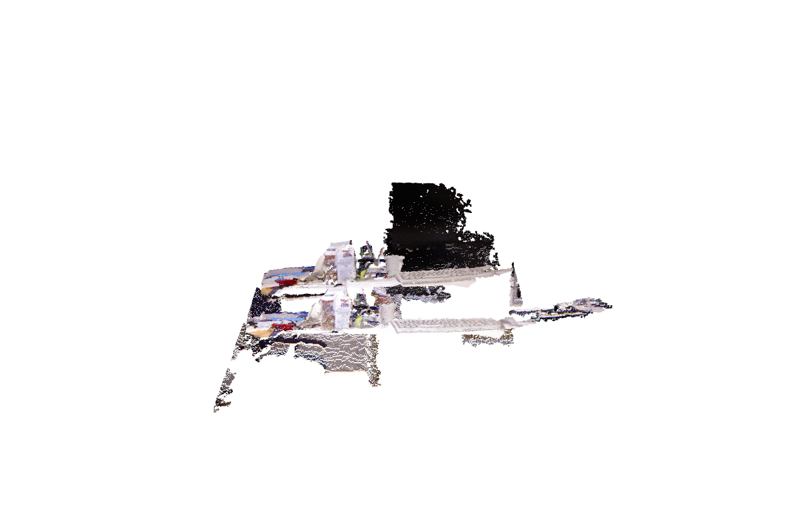
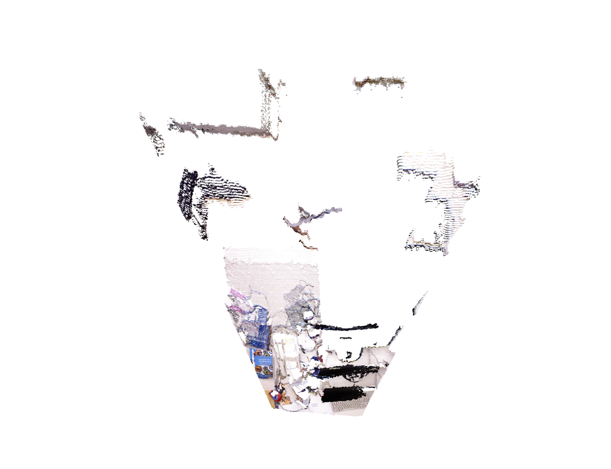
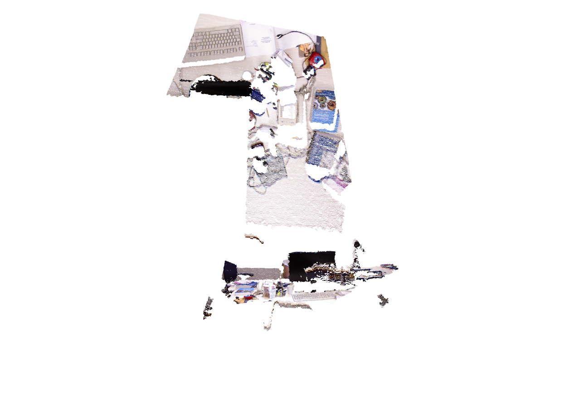
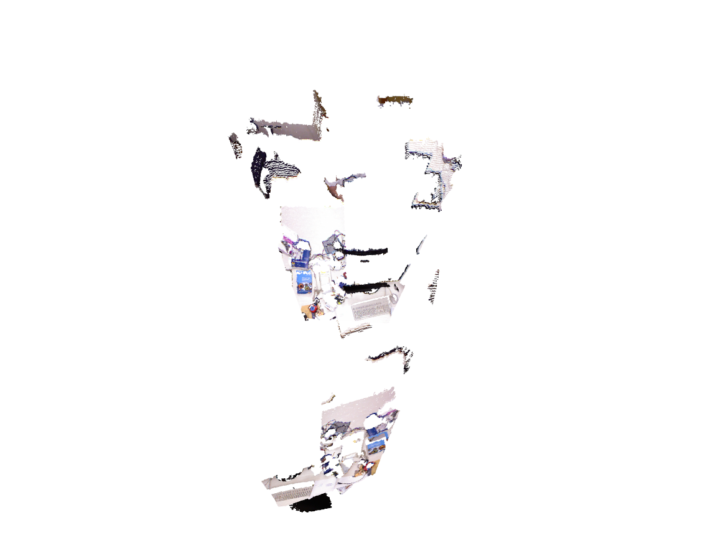
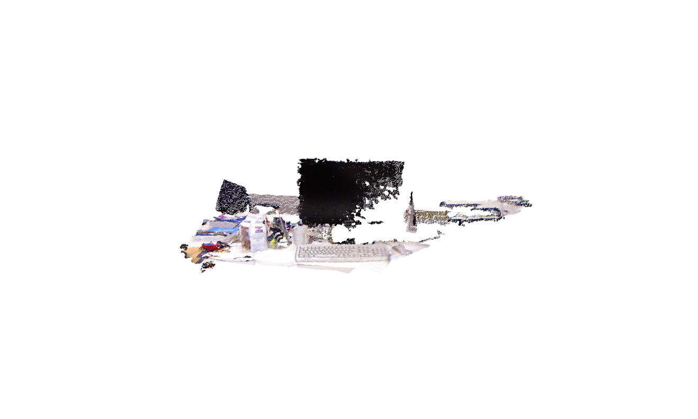
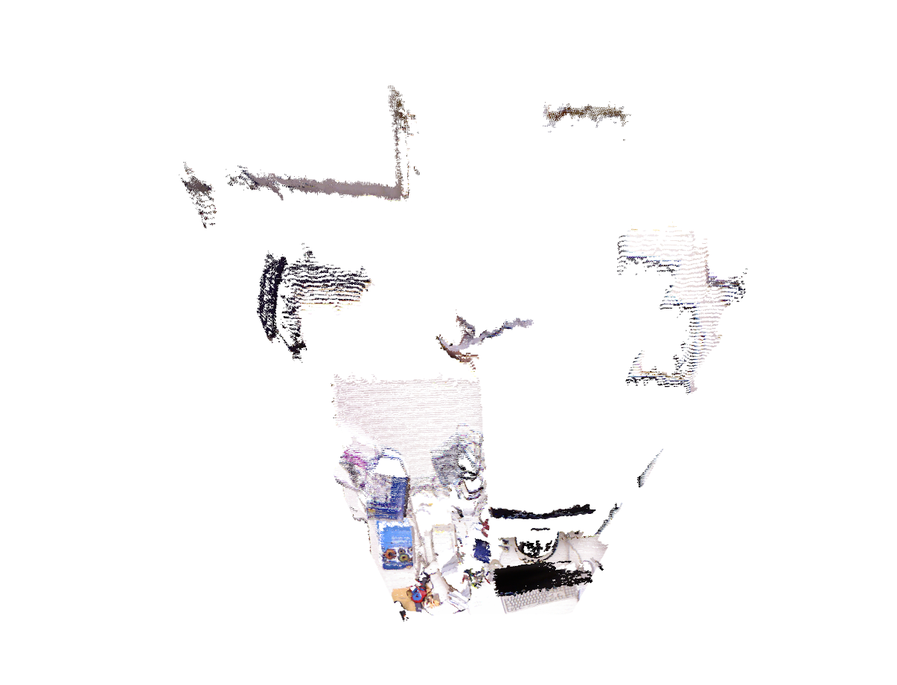
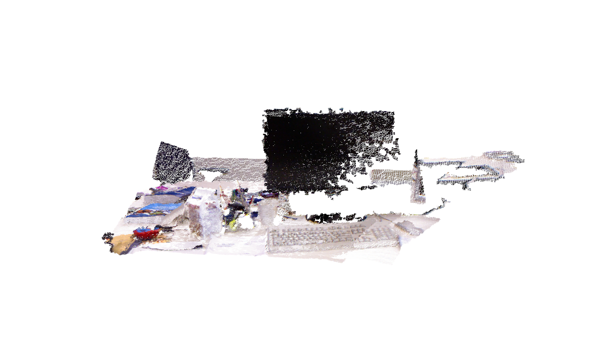
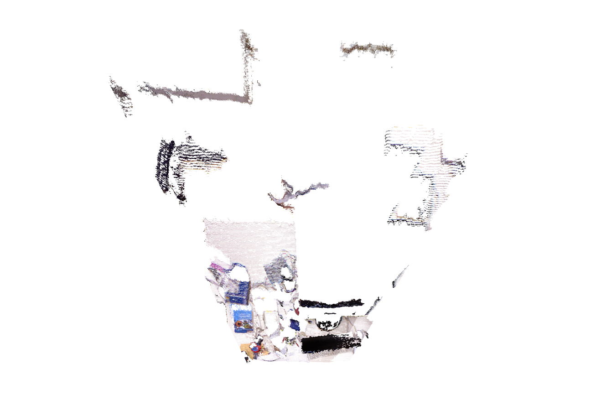

# visual-slam-assignement1
Assignment for lecture1. Forked version.

## Overview
Implement a simple RANSAC example for RGB-D images pose estimation. The requirments are as follows:

- (1) Go through the code ``assignment1.ipynb`` and annotate it richly to show that you understand it. There are some comments to get you started.
- (2) Add code to complete the functionality in the places indicated by "Required part for student".
- (3) Experiment with different settings to see how the system behaves in the places indicated by # EXPERIMENT AND ANALYSE. The images below show example outputs from when you run the code.

## Installation

### Python Interpreter: 
We use the python3.

### Pip:
```
pip3 install opencv-python
pip3 install open3d
pip3 install notebook
```
Open the notebook file by running 
```
jupyter notebook
```
and open the ``assignment1.ipynb`` to checkout the details.

## Data: Images to be aligned

- **Color images:**
<p align="center">
  
  
</p>

- **Depth images:**
<p align="center">
  
  
</p>

## Ouput: Expected Aligned Point Cloud (Overlayed using Two Views)

- **Raw Point Could:**
<p align="center">
  <br><b>Front View:</b><br>
  
  <br><b>Top View:</b><br>
  
</p>

- **Point Could Aligned without Ransac:**
<p align="center">
  <br><b>Front View:</b><br>
  
  <br><b>Top View:</b><br>
  
</p>

- **Point Could Aligned with Ransac:**
```diff
- This is the required part.
```
<p align="center">
  <br><b>Front View:</b><br>
  
  <br><b>Top View:</b><br>
  
</p>

- **Point Could Aligned with Ransac and refined densely:**
```diff
+ Extra part for fun.
```
<p align="center">
  <br><b>Front View:</b><br>
  
  <br><b>Top View:</b><br>
  
</p>
